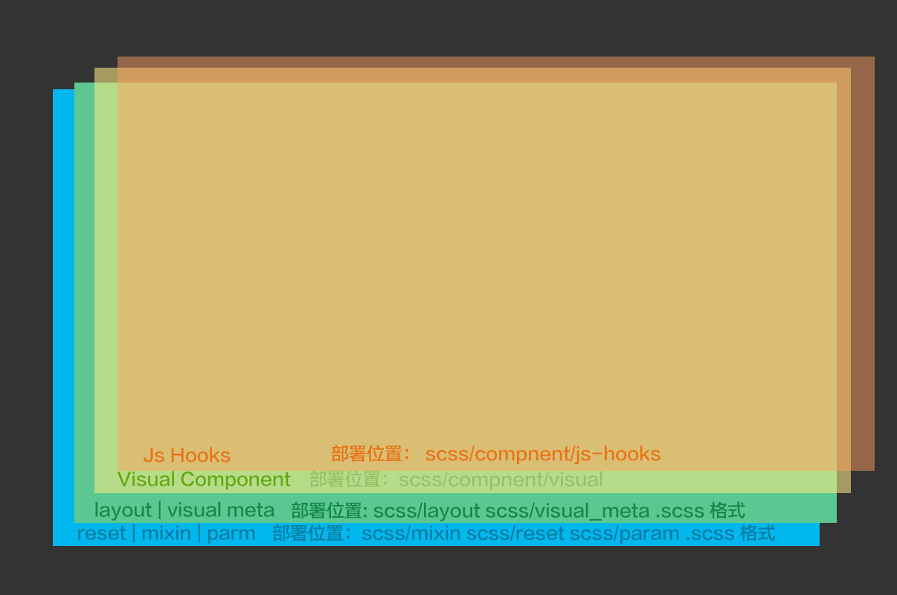

#Frontend Developement Layout Regulation
#前端开发结构规范
>作者： 马哲家昱 Jose Mar

>日期： 2015.8.21

##0.0 前言
当我在做前端开发的日子里，让我最头痛的就是代码乱乱乱，用sass做代码复用的时候也是乱乱乱。虽然把知道吧mixin放在_mixin.scss中，把变量放在_param.scss中。但是再往后走又会发现很多问题。比如，在写module的时候不断重复使用font-size的变量。这个时候，我就在想，这个和直接写px有什么根本的区别呢，都要记住font-size的代码。
胡乱地说了一通，再bb下去，就没人看正文了，让我们马上开始吧。

##0.1 目标
>用优质的工作结构来整体提高前端开发效率和高复用率
>
>优质的工作结构也可以提高设计师和前端工程师的沟通效率

##1 分层结构

>
1. reset-mixin-param层
2. layout-visual meta层
3. visual component层
4. js hooks层

###1.1 推荐目录结构

		/resource	网站资源目录
		|
		|--/scss	sass开发目录
		|	|
		|	|--/reset	重置全局样式
		|	|
		|	|--/mixin	自定义的高重复属性组合效果（如水平垂直居中）
		|	|
		|	|--/param	基础变量标注（尺寸，颜色，复合属性：如2px solid gray）
		|	|
		|	|--/layout	建立栅格系统，常见布局类（细化父子关系）
		|	|
		|	|--/visual_meta  视觉设计元素清单－输出类，（如：边框，hover｜active状态视觉设计）
		|	|	|--/normal 使用简单的
		|	|	|
		|	|	|--/js_hooks 建立js钩子的类，类以`js-`开头，可以@extend 无钩父类
		|	|
		|	|--/component
		|	|	|
		|	|	|--/visual layout和visual_meta组成的
		|	|	|
		|	|	|--/module
		|	|	
		|	
		|--/css
		|--/js
		|	|--/js-hooks
		|	|	|
		|	|	|--/visual_meta 来自visual_meta的js-hooks需求		|	|	|
		|	|	|--/component	来自component的js-hooks需求
		|	|	|	|
		|	|	|	|--/visual  来自visual-component的js-hooks需求
		|	|	|	|--/module	来自module的js-hooks需求
		
##2 逐层分析

###2.1 根基层：reset-param-mixin

####论证：
1. 对于设计师来说，譬如边框宽度，不能想多宽就多宽，任何宽度都要进行定义，一方面规范，另一方面开发起来效果也会更加统一，在定义基本的标注因此非常的重要，那些想怎么画就怎么画的设计师要注意了，一时你画图爽了，前端工程师就不可能爽了，前端工程师不爽了，到时候你有觉得前端工程师没按照你的设计来做。（不好意思:>，太多想吐槽的就不说了）给那些标注尺寸颜色的专业设计师点赞。
2. 对于前端工程师来说，reset讲html归原成白纸，套入设计师定义的变量之后不会因为浏览器内置变量走形，mixin让组合属性效果变的更加简单。比如你要写一个生成一个小三角，然后用的比较多的话，可以写成mixin。

这三个小伙伴构成了我们的根基层。

###2.2 布局＋视觉元层

####论证：
1. 布局必不可少，拥有布局类后，在html中为整个网页来布局，然后可以用这些布局类为下一层的组件内部来进行布局
2. 视觉元：视觉元应该列一个清单，输出为一个类，视觉元中的所有的类样式都会有在开发中用到，并且可以直接的用在html中，不过不建议这么使用。(边框，阴影，圆角，字体颜色，字体大小)

		//静态的例如：
				.border-blue-1px{
					border:1px solid blue;
				} 
				.border-blue-2px{
					border:2px solid blue;
				}
		//动态的例如：
				.border-hover-1px{
					border:none;
				}
				.border-hover-1px:hover{
					@extend .border-blue-1px;
				}
				
有了这一层布局＋视觉元层之后，任何样式的元素和文档都可以直接开发出来了。但是为了复用，我们多了下面的一层**组件层**

###2.3 组件层
组件包括了***视觉组件***,***模块***，这两种类型都是由下层类构成，不过***视觉组件***有更强的可复用性，而模块是包含特定业务逻辑的组件（结构性和包含一组定义行为的js钩子）

####论证
1. 任何页面都是由一个个组件构成，这些组件有：
导航栏，分页，各式的导航，图片轮播banner，上传组件等。要做到一个组件，最重要的是做好依赖管理，包括以来css和依赖的js甚至是依赖的html结构
2. 上述的组件有一部分是可以复用的，即可以在其他项目或者页面重复使用的，而有一部分是变化很快的，不可复用，比如富信息展示页面。

##3 结束语
> 希望在大家的努力下，前端的开发会更加的令人愉悦，让前端和设计可以结合成一把锋利的武士剑，让前端工程师称为传统和现代结合的武士。

